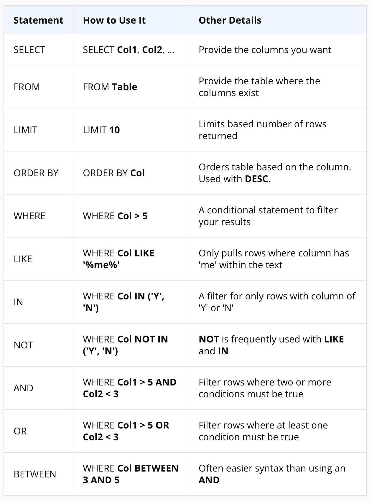

# SQL TO DATA ANALYST
SQL for Data Analyst using the pastgresSQL 

## RUNNING
- docker-compose up -d

## GET - PgAdmin
- http://localhost:8080

## SCRIPT NOTES (STATEMENTS AND CLAUSES)
- SELECT : é usada para recuperar dados de um banco de dados
- LIMIT : é usada para restringir o número de linhas retornadas pela consulta
- ORDER BY : é usada para ordenar os resultados de uma consulta em ordem ascendente ou descendente
- WHERE: é usada para filtrar registros que satisfazem uma condição específica
- OPERATORS: ARITCHMETIC, LOGICAL, COMPARISON
- OPERATORS LOGICAL: LIKE, IN, NOT, AND, OR, BETWEEN

 

  

A cláusula JOIN em SQL é usada para combinar registros de duas ou mais tabelas com base em uma condição relacionada entre elas. Existem vários tipos de JOIN, cada um com sua própria finalidade. Vamos explorar os diferentes tipos de JOIN e fornecer exemplos para cada um.

### Tipos de JOIN
- INNER JOIN
- LEFT JOIN (ou LEFT OUTER JOIN)
- RIGHT JOIN (ou RIGHT OUTER JOIN)
- FULL JOIN (ou FULL OUTER JOIN)
- CROSS JOIN
- SELF JOIN

